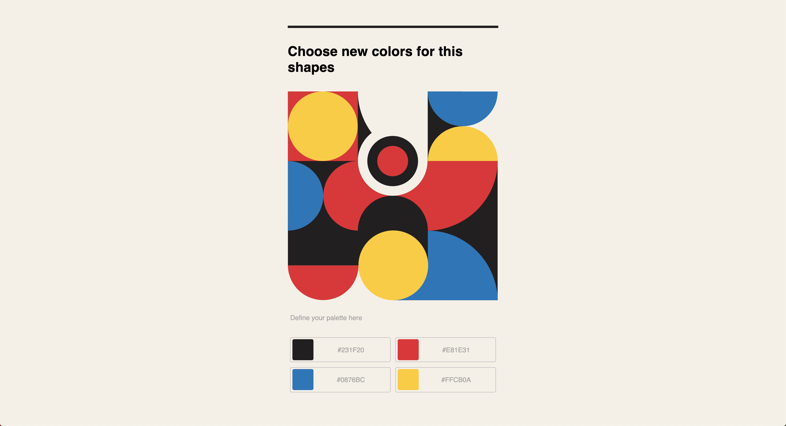

# Color Picker
 

### What I wished as a result
I wanted to create a solution to change the color of a certain image, like for example the Muzli solution I show in the video.

https://www.loom.com/share/4ccbb9882c7c439ca5bb6fb0d0da2579
 
 
### What I achieved
I used a Svg and I created multiple swatches that change the color of the elements of those graphics. For this I used React and I used the following package.

I can gladly say that I achieved the desired result. __This is the result__
 
 

 
 
### What problems I solved
I can’t say that this solves a specific problem, even though this could be a solution for an application where the user can simulate the color of certain elements
 
 

### To install and run the project
Clone the project and run:
 
1. to install the dependencies `yarn install`
2. to run the project `yarn start`
 
 

### By the way
You can check the project online at [codesandbox](https://codesandbox.io/s/dry-surf-y1fsf?file=/src/components/ColorSwatch/ColorSwatch.scss:0-629)
